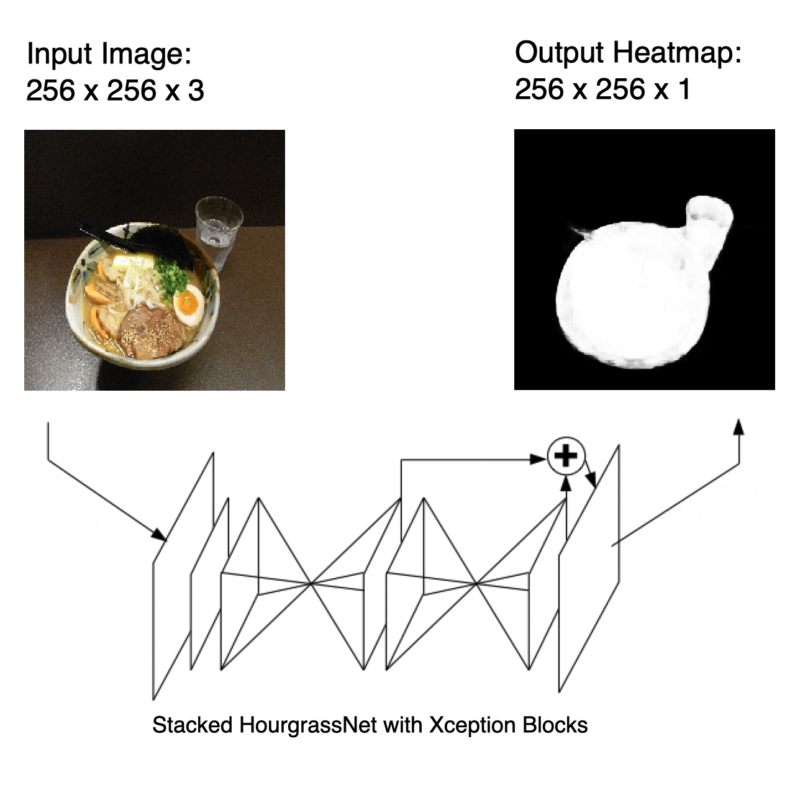
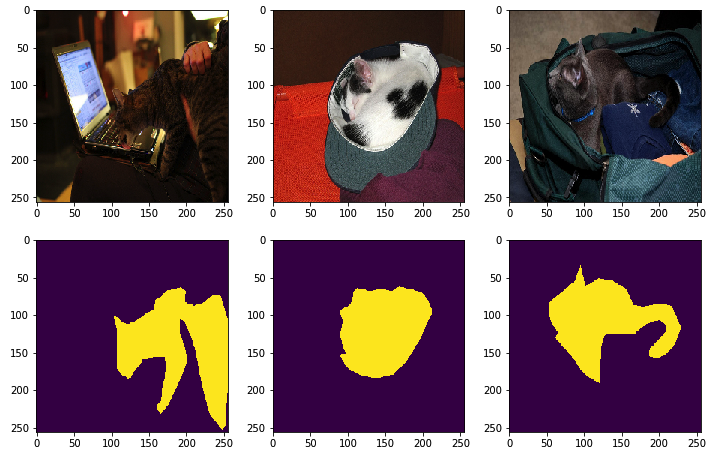
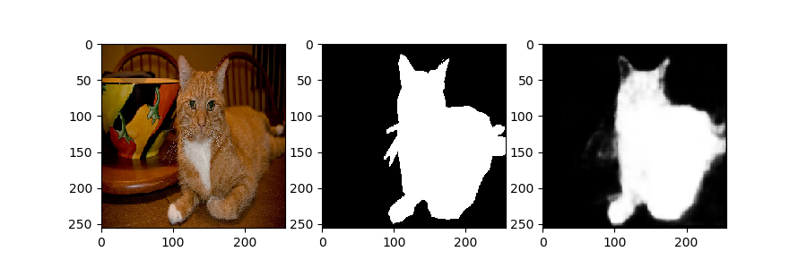

# XceptionHourgrass - PyTorch

I created [Stacked Hourgrass Net](https://arxiv.org/pdf/1603.06937) to mask images or create heat maps for CenterNet. By using the [Xception](https://arxiv.org/pdf/1610.02357) Block, the number of parameters  is reduced despite the large number of layers.

- Stacked Hourgrass Network using Xception Blocks.
- Colored Image input, 1 channel mask or heat map output.
- Use [Mish](https://arxiv.org/ftp/arxiv/papers/1908/1908.08681.pdf) for activation function.

With Original Xception Network, the resolution is reduced (19x19px) in early layer, and do a lot of convolutions in this resolution. It is suitable for classification, but image detail is lost early. So, I adjust and save the details.

# Architecture




The input image will be 96 channels in half size due to the convolutional layer of the header. After that, pass through two Hourgrass, and after UpSampling, pass through one convolution layer.

# Test

## 1.Download COCO Dataset

```sh
$ wget http://images.cocodataset.org/annotations/annotations_trainval2014.zip
$ wget http://images.cocodataset.org/zips/train2014.zip
$ unzip annotations_trainval2014.zip
$ unzip train2014.zip
```

Download a file from the MS-COCO dataset. Here, a mask image is created by extracting only one class from among them.

## 2.Make Test Images

```sh
$ python3 make_testdata.py
```

Prepare a mask image tagged "cat". The original image is resized to 256x256 pixels and the mask image is a one-channel black and white image.

## 3.Preview Data

```sh
$ ls train_files/imgs | wc -l
2818
```

Check the number of files. It is rare for full-scale training. For practical purposes, you need a large dataset.


```python
x = os.listdir("train_files/imgs")
fig = plt.figure(figsize=(12, 12), facecolor="w")
for i in range(3):
    ax = fig.add_subplot(3, 3, i+1)
    ax.imshow(Image.open("train_files/imgs/"+x[i]))
for i in range(3):
    ax = fig.add_subplot(3, 3, i+4)
    ax.imshow(Image.open("train_files/mask/"+x[i]))
plt.show()
```



The cat is cute.

## 4.Train 'cat' Masks


```sh
$ python3 train_testdata.py
```

For the time being, let them learn 20 epochs. 1% of the file is reserved for validation.

## 5.Valid 'cat' Masks


For tests performed in this step, the results are incompletely because the number of files used for training is not large. Here is relatively good results by a small number of training datas.




# References


1. Alejandro Newell, Kaiyu Yang, and Jia Deng "Stacked Hourglass Networks forHuman Pose Estimation" https://arxiv.org/pdf/1603.06937.pdf
2. Franc ̧ois Chollet "Xception: Deep Learning with Depthwise Separable Convolutions" https://arxiv.org/pdf/1610.02357.pdf
3. Diganta Misra "Mish: A Self Regularized Non-Monotonic Neural Activation Function" https://arxiv.org/ftp/arxiv/papers/1908/1908.08681.pdf
4. COCO Dataset http://cocodataset.org/#home